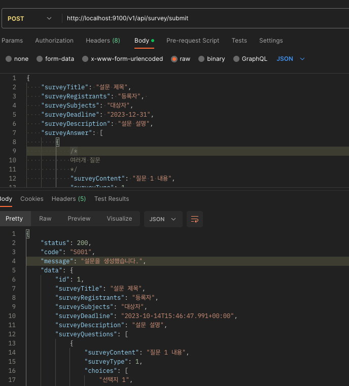

# Spring 기반 설문조사 프로젝트
- 팀원
  - 고나영 - 조선대학교 컴픁터공학과
  - 김민서 - 조선대학교 컴퓨터공학과
  - 문지영 - 조선대학교 컴퓨터공학과 
  - 한결아 - 조선대학교 정보통신공학과
  - 황시준 - 조선대학교 컴퓨터공학과

- 담당
  - Front : 고나영, 한결아 
  - Backend : 김민서, 문지영, 황시준
  - Infra : 김민서, 문지영

 기술 스택 

- Spring Boot
- JPA
- REST API
- HATEOS
- QueryDSL

 프로젝트 특징 

  
- 객체지향 원칙을 지키기 위해 노력했습니다.
- 클린코드 아키텍처를 지향합니다.

  

  DB 설계

현재까지 해당 DB를 가지고 프로젝트를 진행했습니다.(업데이트 됨.)

 진행 사항 

- 설문 제출 기능(관리자)
- 설문 불러오는 기능(관리자)
- 테스트 코드 작성 완료(관리자)
- 설문 응답하기(사용자)
- 설문 결과 확인하기(사용자)

요청 확인

- 설문 생성하기(POST) (http://localhost:9100/v1/api/admin/survey/createSubmit)
     
    
- 설문 불러오기(GET)  (http://localhost:9100/v1/api/survey/result/1)

- 설문 삭제하기(DELETE) (http://localhost:9100/v1/api/admin/survey/delete/1)

- 설문 응답하기(POST) (http://localhost:9100/v1/api/user/survey/submit/1)

- 설문 결과 확인하기(GET) (http://localhost:9100/v1/api/user/survey/submit/1)
- 

 수행해야 할 내용 

- CI/CD 파이프라인 적용
- AsciiDoc 기반의 테스트코드 작성 및 문서화
- 추가 기능 구현(설문 삭제, 수정, 중복 설문 불가 로직 구현 등..)
- 회원 기능 결합
- DB 추가 설계
- 에러 핸들링
- 배포

