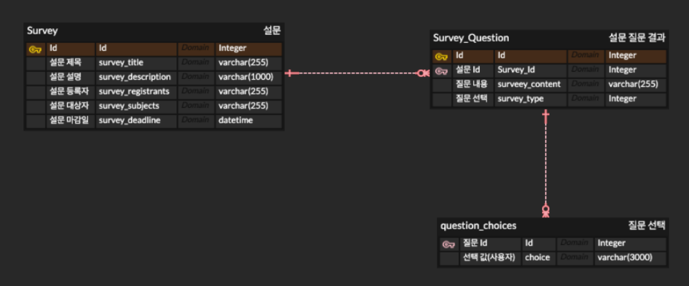

# Spring 기반 설문조사 프로젝트
- 팀원
  - 고나영 - 조선대학교 컴픁터공학과
  - 김민서 - 조선대학교 컴퓨터공학과
  - 문지영 - 조선대학교 컴퓨터공학과 
  - 한결아 - 조선대학교 정보통신공학과
  - 황시준 - 조선대학교 컴퓨터공학과

- 담당
  - Front : 고나영, 한결아 
  - Backend : 김민서, 문지영, 황시준
  - Infra : 김민서, 문지영

- 기술 스택
  - Spring Boot
  - JPA
  - REST API
  - HATEOS

- 프로젝트 특징
  - 객체지향 원칙을 지키기 위해 노력했습니다.
  - 클린코드 아키텍처를 지향합니다.

- DB 설계
  - 현재까지 수행된 설계이며 개선해 나갈 예정입니다.
  

- 진행 사항
  - 설문 제출 기능
  - 설문 불러오는 기능
  - 테스트 코드 작성 완료

- 요청 확인
  - 설문 제출하기(POST) (http://localhost:9100/v1/api/survey/submit)
    - 
  - 설문 불러오기(GET)  (http://localhost:9100/v1/api/survey/result/1)
    - 

- 수행해야 할 내용
  - CI/CD 파이프라인 적용
  - AsciiDoc 기반의 테스트코드 작성 및 문서화
  - 추가 기능 구현(설문 삭제, 수정, 중복 설문 불가 로직 구현 등..)
  - 회원 기능 결합
  - DB 추가 설계
  - 에러 핸들링
  - 배포